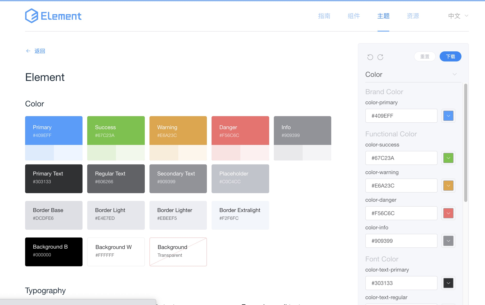

企业大前端架构组件化设计与实践 1

# 1. 前端架构层次设计

前端技术体系庞大，层级也非常分明，在架构设计领域中不能一概而论，任何应用种类都有自己独立的架构体系。比如在前端开发领域，在框架基础上进行应用构建的开发者所思考的问题，与在组件库设计方面的开发者们所思考的问题是完全不同的。所以架构设计方面是有层次划分的，大体可以分为四个层次，如图所示：

## 1.1 系统级

例如： 前后端分离架构，微前端架构
应用在整个系统内的关系，如与后台服务器通信，与第三方系统集成

## 1.2 应用级

例如：模式库，组件库，设计系统
应用外部的整体架构，如多个应用之间如何共享组件，如何通信等等。

## 1.3 模块级

例如：组件化，模块化
应用内部的模块架构，如代码的模块化，数据和状态的管理等等

## 1.4 代码级

例如： 规范，原则，质量
即从基础设施来保障架构实施

# 2. 前端的组件化架构

前端的组件化架构是将项目中广泛使用的关注点分离出来，作为可复用的组件进行对外提供。这种方式可以让分离出来的每一个小部分都拥有自己的关注点。这种拆分方式可以将一个复杂的视图组成或功能，拆分成多个松散耦合的独立组件，大大的降低系统的复杂度。

用这个方式来看待应用架构，是一种有顶至底的方式。而在日常开发中，我们则是由底至上来开发应用的，即先构建 UI 组件，在构建页面。从前端来看，组件可以被视为构成用户界面的一个小功能，其表现形式是组件库，而组件库的作用是通过复用已有的组件来快速构建 UI 应用。从 UI 设计者来看，单单只有组件是不够的，还需要关注他们之间的配合。

所以，在创建一套组件系统时，所经历的步骤必然在于实际应用中封装一个独立组件的步骤要多很多。在组件库制作前首先需要制作一套设计指南，这个设计指南会体现组件库的设计理念，初心，颜色搭配、排版布局等等一系列设计和规则。其步骤会经历以下内容：

## 2.1 原则与模式

在实际搭建组件前，需要对整个的组件库做出完善的 UI 设计，如按钮、表单输入元素、导航菜单、模态框和图标，以及设计规范。
这里需要设计的是我们所搭建的组件库所有的基础 UI 组件如何组合搭配形成一个页面。他们摆放的位置和相互的关系就是一个 UI 系统特有的模式。
比如 ElementUI 的官网网站上就会贴出该组件库的设计指南 https://element.eleme.cn/#/zh-CN/guide/design
一旦设计原则与模式已经定义出来了，就需要去使用并遵守他们。设计原则与模式的过程光靠前端工程师本身是不足以实现的，还需要配合团队的设计人员才能将整体的风格和搭配模式作出统一的规范。

## 2.2 色彩

色彩是设计指南中最重要的部分之一，任何的网站都有自己的专有配色，比如支付宝是蓝色的，BOSS 直聘是绿色的等等。

他们时刻提醒我们选择一个好的颜色的重要性。一家互联网公司的主要产品只有那么几个，应用的颜色便也和公司、组织的形象相关联。若是组织与应用的色调不一致，那么会损坏品牌的形象。

在 Web 应用中，由于黑底白字不能突出重要的内容，所以需要一些列的颜色来创建用户友好的界面。在这些颜色中，通常会被做如下的分类：

- 主题色： 又可以成为品牌颜色，用于体现产品的特性以及宣传时使用。
- 功能色： 用来展示数据和状态，以及提醒用户
- 中性色： 用于常规的页面显示和过度，通常是浅色和深色的变种，如白色和灰色。

有很多的前端 UI 框架中都会定义集中类型的颜色，其对应了上述三部分中的功能色和主题色：

- primary(主题色)
- success(成功色)
- danger(危险色)
- warning(警示色)
- info(提示色)

关于色彩的实际定义方式，任然可以参考 ElementUI 的官方文档，在色彩的部分有明确的定义，并且框架也是非常遵循设计原则的框架之一。


[element 主题](https://element.eleme.cn/#/zh-CN/theme/preview)

## 2.3 文字排版

对于字体而言，在开发应用时要考虑的因素有字体大小，字体颜色，行高，字重以及字体家族。对于风格指南而言，我们更关注与选择大小合适的字体。字体大小所针对的常用的标题 h1-h6，以及普通的段落 p。从 h6 到 h1,他们以一定的字节在不断的变大。在早期的 windows 系统里，某些字段没有 13px 大小的字体，因而采用的时偶数。这种奇怪的习惯也被保留到今天，因而多数字体的大小是偶数。通常设计人员在大于 14px 的字号中选择合适的大小。

宋体、楷体和黑体，是日常开发中最常接触的中文字体类型，其他中文字体也会有一些，但不常用。在不同的系统上，字体使用情况如下所示。

- macOS,平方简体：PingFang SC.
- windows, 微软雅黑： Microsoft YaHei。
- Linux,开源字体文泉驿微米黑： WenQuanYI Micro Hei.

font-family 定义为什么要加最后一句 sans-serif

## 2.4 布局

在实际组件库设计过程中，组件和组件间的排版布局也是设计过程中需要设计的部分，好的布局可以让组件产生 1+1>2 的配合效果，不好的布局会使单独看起来不错的组件一旦组合之后变得杂乱无章。
通常的布局系统中会存在两种方式

### 2.4.1 栅格系统

### 2.4.2 Flex 弹性布局

2.4.1 和 2.4.2 的具体实现可以直接参考https://element.eleme.cn/#/zh-CN/component/layout的文档介绍。

## 2.5 组件

对于设计人员来说，风格指南的组件知识在设计时使用的--从某个统一的组件中复制出一个组件的样式，在粘贴到具体的页面设计中。对于开发人员来说，早期的风格指南中的组件，更多的使用于 CSS 上。单击相应的组件便可以复制相应的 CSS，或相应的 class，然后可以直接粘贴到代码中。

前端开发人员可以从这个统一的风格指南中获益，只需要复制，粘贴便可以轻松的完成任务，其中麻烦和困难的地方就是创建组件库，这个麻烦的地方在完成设计阶段的介绍之后会以编程的方式实现。

## 2.6 文档及其他

对于设计指南来说，我们还需要考虑的因素是文档。在文档中我们要指明：

- 设计人员如何使用设计指南
- 开发人员如何维护设计指南
- 如何在项目中使用设计指南
- 常见的问题和解决方案等
  此外风格指南中还应该包含一系列的设计细节和规范
- 使用图片规范，不同位置图片的大小，一般采用什么格式的图片等等。
- 留白间距，诸如 padding 默认的是 n\*4px,即对应的 4 的倍数。
- 同一的圆角大小

## 2.7 维护风格指南

风格指南不是创建出来就能坐享其成的，而是需要持续不断的改进的。对于项目周期长的应用来说，其风格指南在周期里会不断地演进，置至能满足现有的设计。因此，在开发应用和风格指南的整个周期里，都需要开发人员和设计人员在改造设计指南上不断的投入精力。哪怕一个细微的变化，也要及时的更新。

有了设计指南，开发人员不用再重复的创造颜色不一致的按钮，方向不一样的动画，大小差距比较大的标题等，只要使用统一的 class 就行了，设计与代码不同，设计多一主观为主，很难制定相应的规范。但是，设计人员也会从中受益，他们花费更少的时间在实现高保真设计上，并且关注与创建出更好的用户体验。设计人员不在纠结于使用什么颜色，只需要从色板上选择合适的颜色即可。也不再纠结于某一元素的 px 大小，只需要按照规范实施即可。

前端应用随着业务的发展变得越来越复杂，单纯的风格指南越来越难以满足前端框架的需求。前端的组件不再是使用 CSS 和 HTML 就能完成的，他也需要编写一定的 Javascript 才能使用，框架也从 CSS 库变成了真正的组件库

# 组件化架构实践

有了以上组件库规划的基础知识，我们便可以开启组件库架构设计的具体实施。本次内容假设设计阶段已经结束。

## 3.1 创建项目

### 3.1.1 创建原则

### 3.1.2 回顾包管理器

### 3.1.3 镜像管理器

## 3.2 构建一个命令行工具

在这几组件库之前,我们先通过设计一个简单的命令行工具，提升一下 nodejs 的编码能力和抽象应用设计能力。


### 3.2.1 p-nrm 命令行创建

1. 创建命令行项目
2. 添加 bin/index.js

3. 在 bin/index.js 中添加代码

```javascript
#!/usr/bin/env node
console.log("hello");
```

4. 在 package.json 中添加

```
  "bin": {
    "p-nrm": "bin/index.js"
  },
```
### 3.2.2 将代码安装到电脑上

1. npm pack 
2. npm install ./p-nrm-1.0.0.tgz -g
3. npm ls -g 就能看到p-nrm命令已经安装，执行命令就能看到输出的hello

node是如何将p-nrm创建到全局命令行工具的，
* npm ls -g
* npm config list

### p-nrm 建设

1. 读取运行参数

### 3.2.4 测试

* 单元测试
把代码看成一个个组件，对每个组件进行单独测试
测试内容主要是组件内每个函数的返回结果是不是和期望值一样
代码覆盖率
* e2e测试
把程序当做是黑盒子，对于特定的输入，是否能得出对应的结果

npm 包版本更新

变更第一位
> npm version major -m 'escription'
变更第二位
> npm version minor -m 'escription'
变更第三位
> npm version patch -m 'description'

3.3.1 什么是npm私服

npm私服和私有的git仓库有着非常相似的作用， npm私有的仓库

3.3.2 verdaccio 简介

> npm i verdaccio -g